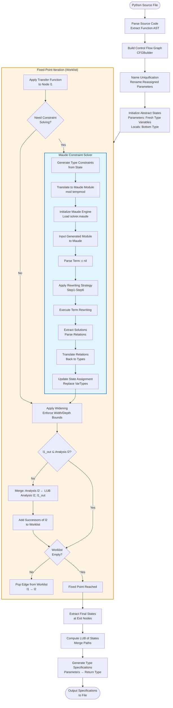
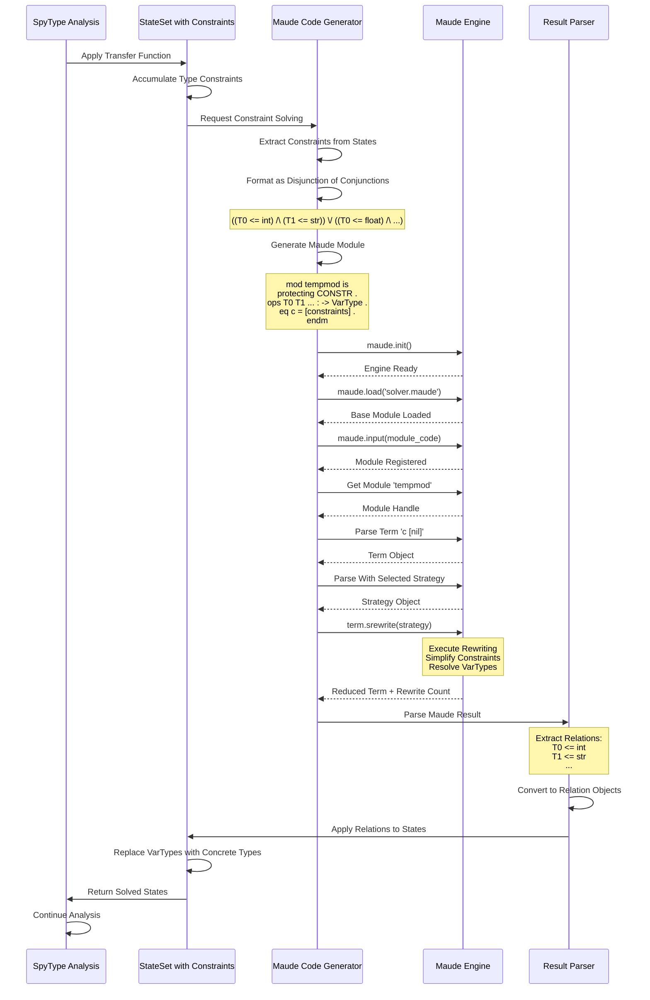

# SpyType Architecture Diagrams

## System Architecture Flow



### Explanation: System Architecture Flow

This diagram illustrates the complete analysis pipeline from Python source code to type specifications.

#### Initial Processing Phase

**Parse Source Code**: The analysis begins by parsing the input Python file and extracting Abstract Syntax Trees (ASTs) for each function definition. The AST represents the syntactic structure of the code in tree form.

**Build Control Flow Graph**: Using the modified Staticfg library, SpyType constructs a Control Flow Graph (CFG) for each function. The CFG captures all possible execution paths through the function, representing branches, loops, exception handlers, and other control flow constructs. Each node in the CFG corresponds to a program statement.

**Name Uniquification**: Before analysis, SpyType performs a name transformation to handle parameter reassignments. When a function parameter is reassigned within the function body, the reassigned version is renamed (e.g., parameter `x` becomes `_x` after reassignment). This prevents confusion between the original parameter value and its reassigned version, simplifying the tracking of type information through the function.

**Initialize Abstract States**: The analysis constructs initial abstract states for the function entry point. Function parameters are assigned fresh type variables (representing unknown types to be inferred), while local variables receive bottom types (representing "no information yet").

#### Fixed-Point Iteration (Worklist Algorithm)

The core of the analysis is a worklist-based fixed-point computation that systematically explores all control flow paths:

**Worklist Processing**: The algorithm maintains a worklist of CFG edge pairs (l1 → l2) representing dependencies. For each edge, it computes the output state of the source node l1 and checks whether this provides new information for the target node l2.

**Transfer Functions**: At each node, a transfer function analyzes the statement and computes output types based on input types. Transfer functions encode the semantics of Python operations and consult the specification database for built-in function behavior.

**Constraint Solving Integration**: The Maude constraint solver is invoked after processing each CFG node. This subprocess (highlighted in blue) generates type constraints, translates them to Maude's rewriting logic format, executes the solver, and translates results back to type information. If no constraints exist, the solver returns immediately without performing rewriting.

**Widening**: After constraint solving (or directly if solving isn't needed), widening operators are applied to limit type complexity. This ensures termination by preventing infinite growth of type expressions during loop analysis.

**Fixed-Point Check**: The algorithm checks whether the computed output for l1 is already subsumed by the current analysis result for l2. If new information is discovered, l2's state is updated using the least upper bound (LUB) operation, and all of l2's successors are added back to the worklist for reanalysis.

**Termination**: The iteration continues until the worklist is empty, indicating that a fixed point has been reached where no further type information can be derived.

#### Post-Processing Phase

**Extract Final States**: Once the fixed point is reached, the analysis extracts the abstract states at function exit nodes (return statements and the final block).

**Compute LUB**: If multiple exit paths exist, their states are merged using the least upper bound operation to produce a unified result that captures all possible return scenarios.

**Generate Specifications**: The merged state is converted into a type specification showing the relationship between parameter types and return types. This specification represents the inferred type signature of the function.

**Output**: The final specifications are formatted and written to the output file in human-readable notation.

## Data Flow: SpyType ↔ Maude Communication



### Explanation: SpyType ↔ Maude Communication Protocol

This sequence diagram details the interaction between SpyType's analysis engine and the Maude constraint solver, showing the complete lifecycle of a constraint solving request.

#### Constraint Accumulation Phase

**Apply Transfer Function**: When SpyType processes a program statement, the transfer function computes the effect of that statement on abstract types. This may introduce new type variables and relationships between them.

**Accumulate Type Constraints**: As the analysis progresses, the StateSet accumulates constraints representing type relationships. These constraints express requirements such as "type variable T0 must be a subtype of int" (written as `T0 <= int`) or similar type relationships. Constraints accumulate from multiple sources: variable assignments, function calls, arithmetic operations, and control flow merges.

**Request Constraint Solving**: After each transfer function application, the constraint solver is invoked unconditionally. However, if a state has no constraints, it returns immediately without actually invoking Maude. This means the solver is always called, but does actual work only when constraints exist.

#### Constraint Translation Phase

**Extract Constraints from States**: The generator examines all states in the StateSet and extracts their constraint sets. Each state may have different constraints representing alternative execution scenarios.

**Format as Disjunction of Conjunctions**: The constraints are structured as a disjunction (OR) of conjunctions (AND). Each conjunction represents a consistent set of type relationships for one possible execution path. For example: `((T0 <= int) /\ (T1 <= str)) \/ ((T0 <= float) /\ (T1 <= list))` means "either T0 is a subtype of int and T1 is a subtype of str, or T0 is a subtype of float and T1 is a subtype of list."

**Generate Maude Module**: The generator constructs a complete Maude module containing:
- Module declaration protecting the base CONSTR module
- Pre-declared operator declarations for 200 type variables (T0 through T199) and 200 bound variables (T?0 through T?199), regardless of how many are actually used
- An equation defining the constraint term `c` as the disjunction of conjunctions

For example, if the analysis has accumulated constraints from two possible execution paths, the equation might look like:
```
  eq c = (T2 <= int + float) /\ (T2 <= int + T?1) .
```

#### Maude Engine Initialization

**maude.init()**: Initialize the Maude interpreter engine. This prepares the Python-Maude bindings for operation.

**maude.load('solver.maude')**: Load the base solver module containing the CONSTR module definition. This module provides the fundamental types, operations, and rewriting rules for constraint solving, including subtype relationships, type lattice operations, and constraint simplification strategies.

**maude.input(module_code)**: Submit the generated temporary module to Maude. This registers the module and makes it available for term evaluation and rewriting.

**Get Module 'tempmod'**: Retrieve a handle to the loaded module, enabling subsequent operations on terms defined within it.

#### Term Rewriting Execution

**Parse Term 'c [nil]'**: Construct the initial term representing the constraint system. The term `c` represents the constraint equation, and `[nil]` represents an empty accumulator or result list.

**Parse Strategy**: Parse the rewriting strategy string that controls how Maude simplifies the constraints. The strategy specifies a sequence of rewriting steps (Step1 through Step6), each applying specific transformation rules. The exclamation marks indicate that each step should be applied exhaustively until no more rules match.

**term.srewrite(strategy)**: Execute strategic rewriting on the constraint term. Maude applies its rewriting rules according to the strategy, performing operations such as:
- Simplifying redundant constraints
- Propagating type information through the constraint graph
- Resolving type variables to concrete types where possible
- Eliminating inconsistent constraint branches
- Computing least upper bounds for type unions

The rewriting process transforms the complex constraint system into a simplified form where type variables are explicitly bound to types.

#### Result Processing Phase

**Reduced Term + Rewrite Count**: Maude returns the fully reduced term along with statistics about how many rewrite operations were performed. The reduced term represents the solved constraint system.

**Parse Maude Result**: The parser analyzes the reduced term string returned by Maude. It identifies relations of the form `T0 <= concrete_type` that specify the resolved types for type variables.

**Extract Relations**: The parser extracts individual type relations from the result. Each relation maps a type variable (like T0) to a basetype (like int or list<str>) using the `<=` operator to denote subtyping.

**Convert to Relation Objects**: The parsed relations are converted into SpyType's internal Relation objects, which can be manipulated and applied to states.

#### State Update Phase

**Apply Relations to States**: The relation objects are used to update the StateSet. Each relation specifies how to replace a type variable with a concrete or more refined type.

**Replace VarTypes with Concrete Types**: For each state in the StateSet, the analysis substitutes type variables with their solved types. This transforms abstract constraints into concrete type information that can be used for further analysis.

**Return Solved States**: The updated StateSet, now containing more precise type information, is returned to the main analysis engine.

**Continue Analysis**: With the newly resolved type information, SpyType continues its fixed-point iteration, using the solved types to analyze subsequent program statements.
